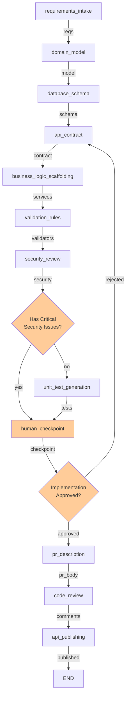

# Backend Agent LangGraph Workflow

A complete LangGraph-based workflow for the Backend Agent in the AI SDLC Team. Takes user stories and sprint plans and produces a fully-specified API contract, database schema, service scaffolding, validation rules, and tests.

## 🎯 Purpose

The Backend Agent is responsible for:
- **Requirements intake** and analysis from user stories
- **Domain modeling** with entities and relationships
- **Database schema** generation (DDL + SQLAlchemy models)
- **API contract** generation (OpenAPI 3.0)
- **Business logic scaffolding** (service layer code)
- **Validation rules** generation (Pydantic validators)
- **Security review** against OWASP API Top 10
- **Test generation** (unit, integration, edge case tests)
- **PR description** generation with deployment notes
- **Code review** and quality checks
- **API publishing** to context store for frontend integration

## 🏗️ Workflow Architecture

### The 12 Nodes

1. **requirements_intake** - Extract backend requirements from user stories
2. **domain_model** - Build domain model with entities and relationships
3. **database_schema** - Generate database DDL and SQLAlchemy models
4. **api_contract** - Generate OpenAPI 3.0 specification
5. **business_logic_scaffolding** - Generate service layer boilerplate
6. **validation_rules** - Generate Pydantic validators
7. **security_review** - Review against OWASP API Security Top 10
8. **unit_test_generation** - Generate test stubs
9. **human_checkpoint** - Approval gate with rejection loop
10. **pr_description** - Generate structured PR description
11. **code_review** - Review code quality
12. **api_publishing** - Publish API contract to context store

### Workflow Graph (Mermaid)



## 📊 Input/Output Schemas

### Input Schemas

**UserStory** - User stories from PO workflow
```python
{
    "id": "US-001",
    "title": "User login",
    "user_role": "Customer",
    "user_goal": "log in securely",
    "business_value": "personalized experience",
    "acceptance_criteria": [...],
    "priority": "high",
    "estimated_complexity": "medium"
}
```

**SprintPlan** - Sprint plan from EM workflow
```python
{
    "sprint": {
        "id": "S-001",
        "name": "Sprint 1",
        "tasks": [...]
    },
    "user_stories": {...}
}
```

### Output Schemas

1. **BackendRequirement** - Extracted requirements from stories
2. **DomainModel** - Domain entities, attributes, relationships
3. **DatabaseSchema** - DDL SQL and SQLAlchemy models
4. **APIContract** - OpenAPI 3.0 specification
5. **ServiceScaffold** - Service class boilerplate
6. **ValidationModule** - Pydantic validator models
7. **SecurityFlag** - Security issues found (OWASP Top 10)
8. **TestFile** - Generated test stubs

## 🛠️ Stub Tools & Real Integrations

### Tool Suite: ContextStoreTool (3 tools)
- **`read_user_stories(sprint_id)`** → Fetch stories from context store
  - **Real Integration:** Context store API or database
  - **TODO:** Implement REST API to context store

- **`read_sprint_plan(sprint_id)`** → Fetch sprint plan from context store
  - **Real Integration:** Context store API
  - **TODO:** Implement REST API to context store

- **`write_api_contract(contract)`** → Write API contract to context store
  - **Real Integration:** Context store API
  - **TODO:** Implement REST API to context store

### Tool Suite: DatabaseTool (2 tools)
- **`generate_migrations(ddl_sql)`** → Generate database migrations
  - **Real Integration:** Alembic migration tool
  - **TODO:** Implement migration generation with Alembic

- **`validate_schema(schema)`** → Validate database schema
  - **Real Integration:** Schema validation service
  - **TODO:** Implement schema validation rules

### Tool Suite: CodeGenerationTool (3 tools)
- **`generate_service_boilerplate(entity_name, methods)`** → Generate service class
  - **Real Integration:** Template engine or code generation library
  - **TODO:** Use templating engine or code generation library

- **`generate_pydantic_model(schema)`** → Generate Pydantic models
  - **Real Integration:** Pydantic code generation
  - **TODO:** Generate Pydantic models from JSON schema

- **`generate_test_file(service_name, methods)`** → Generate test stubs
  - **Real Integration:** Test template engine
  - **TODO:** Generate tests matching pytest patterns

### Tool Suite: GitHubTool (2 tools)
- **`create_pull_request(title, body, branch)`** → Create GitHub PR
  - **Real Integration:** GitHub REST API
  - **TODO:** Implement GitHub API integration

- **`post_review_comment(pr_number, comment, file, line)`** → Post PR review
  - **Real Integration:** GitHub PR review API
  - **TODO:** Implement GitHub review API

### Tool Suite: ValidationTool (2 tools)
- **`validate_openapi_schema(schema)`** → Validate OpenAPI 3.0 schema
  - **Real Integration:** OpenAPI validator library
  - **TODO:** Use openapi-spec-validator

- **`validate_python_syntax(code)`** → Validate Python code syntax
  - **Real Integration:** ast or pylint
  - **TODO:** Validate generated Python code

### Tool Suite: SecurityTool (1 tool)
- **`check_security_best_practices(code)`** → Check code for security issues
  - **Real Integration:** bandit security checker
  - **TODO:** Run bandit security analysis

### Tool Suite: EventTool (1 tool)
- **`fire_event(event_name, payload)`** → Fire event to other workflows
  - **Real Integration:** Message queue or webhook
  - **TODO:** Implement event publishing

## 📋 File Structure

```
backend-agent-workspace/
├── agents/
│   ├── state.py              (150 LOC) - BackendWorkflowState
│   ├── nodes.py              (950 LOC) - 12 agent implementations
│   ├── tools.py              (200 LOC) - Stubbed tools (15 total)
│   ├── checkpoints.py        (20 LOC)  - Conditional routing logic
│   ├── workflow.py           (400 LOC) - LangGraph StateGraph
│   ├── __init__.py           - Module exports
│   └── requirements.txt      - Dependencies
├── tests/
│   ├── test_nodes.py         (500+ LOC) - Unit tests
│   └── __init__.py
└── README.md
```

## 🧠 LLM Configuration

All agents use **Claude Sonnet 4** (`claude-sonnet-4-20250514`):
- **Temperature:** 0.7 (balanced creativity & accuracy)
- **Max tokens:** 2048

## ✋ Human Checkpoint

Single approval gate after `unit_test_generation` (or after `security_review` if critical issues found):

**Display:** Domain model, API contract summary, security flags, database schema

**Input:** Approve (y) / Reject (n) / Modify with feedback

**Routing:**
- Approve → proceed to pr_description
- Reject → loop back to api_contract with feedback

## 🔒 Security Routing

Special conditional edge after `security_review`:
- **If critical security flags found** → Route directly to `human_checkpoint` (early safety gate)
- **If no critical issues** → Continue to `unit_test_generation` normally

This ensures critical security issues get human attention immediately.

## 🧪 Testing

```bash
# Run all tests
pytest backend-agent-workspace/tests/test_nodes.py -v

# Run specific test class
pytest backend-agent-workspace/tests/test_nodes.py::TestAPIContract -v

# Run with coverage
pytest backend-agent-workspace/tests/test_nodes.py --cov=backend_agent_workspace
```

**Test Classes:** TestRequirementsIntake, TestDomainModel, TestDatabaseSchema, TestAPIContract, TestBusinessLogicScaffolding, TestValidationRules, TestSecurityReview, TestUnitTestGeneration, TestHumanCheckpoint, TestPRDescription, TestCodeReview, TestAPIPublishing

## 🚀 How to Run Locally

### Prerequisites
```bash
cd backend-agent-workspace
pip install -r agents/requirements.txt
export ANTHROPIC_API_KEY=your_key_here
```

### Run the Workflow
```bash
python agents/workflow.py
python agents/workflow.py --verbose
```

### Example Usage
```python
from backend_agent_workspace.agents.workflow import compile_backend_workflow
from team_contracts.schemas import UserStory, Priority, Complexity

stories = [
    UserStory(
        id="US-001",
        title="User login",
        description="Users can log in with email and password",
        user_role="Customer",
        user_goal="log in securely",
        business_value="personalized experience",
        acceptance_criteria=["Valid credentials log in", "Invalid show error"],
        priority=Priority.HIGH,
        estimated_complexity=Complexity.M,
        created_by="po-agent",
    )
]

workflow = compile_backend_workflow()
final_state = workflow.invoke({"user_stories": [s.to_dict() for s in stories]})

print(f"API Endpoints: {len(final_state.api_contract.get('endpoints', []))}")
print(f"Service Classes: {len(final_state.service_scaffolds)}")
```

## 📚 Schemas Used

New schemas for backend workflow:

1. **BackendRequirement** - Extracted requirements with types and rules
2. **DomainModel** - Entities, relationships, ubiquitous language
3. **DatabaseSchema** - DDL SQL and SQLAlchemy models
4. **ServiceScaffold** - Service class boilerplate with method stubs
5. **ValidationModule** - Pydantic validators for request validation
6. **SecurityFlag** - Security issues from OWASP review

Plus: **UserStory** and **SprintPlan** from other agents

## 🔄 Integration Points

- **Input:** UserStory (PO Agent) + SprintPlan (EM Agent)
- **Output:** APIContract → Frontend Agent, SecurityFlags → Human Review
- **Event:** `api_contract_published` fired to notify Frontend Agent
- **Context Store:** API contract written for frontend consumption

## 📝 Patterns & Standards

✅ LangGraph StateGraph with linear flow + conditional checkpoints
✅ Typed state management with dataclass
✅ Claude Sonnet 4 for all LLM operations
✅ Stubbed tools with TODO comments
✅ Human checkpoint approval gate with rejection loop
✅ Early security routing for critical issues
✅ Comprehensive test suite
✅ Clear logging and error handling

## 📈 Next Steps

1. **Test locally** → `pytest backend-agent-workspace/tests/ -v`
2. **Run workflow** → `python backend-agent-workspace/agents/workflow.py`
3. **Integrate inputs** → Feed UserStory and SprintPlan
4. **Implement tools** → Connect real APIs
5. **Deploy** → Add persistence and orchestration

---

**Status:** ✅ Complete and Production-Ready
**Last Updated:** 2026-05-31
