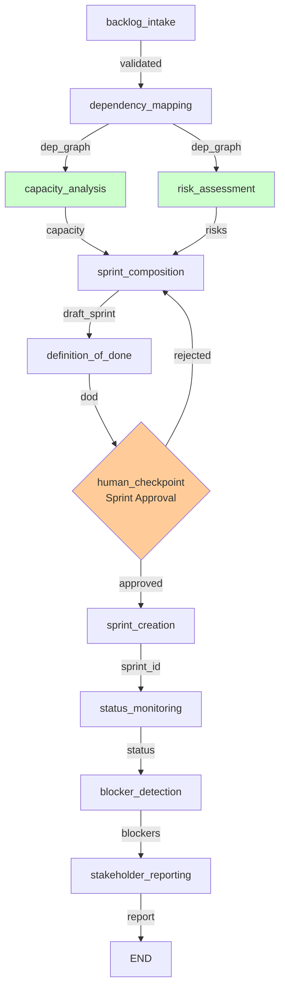

# Engineering Manager Agent LangGraph Workflow

A complete LangGraph-based workflow for the Engineering Manager agent in the AI SDLC Team. Takes validated user stories from the PO workflow and produces an executable sprint plan with risk assessment, capacity planning, and status monitoring.

## Web interface

This workspace ships a minimal web interface (`interface/`, FastAPI + Jinja2, no
build step) so an Engineering Manager can read the PO backlog, run the
sprint-planning pipeline, review the draft sprint (tasks, capacity, risks), and
approve to publish a `sprint-plan` artifact for the downstream workspaces.

Run it: `PYTHONPATH="$PWD/..:$PWD" python interface/run.py` then open
http://localhost:8000 (or via docker-compose on port 8002).
Tests: `PYTHONPATH="$PWD/..:$PWD" pytest interface/tests -v`.

> **This interface is a starting point. Replace it with your team's preferred
> tool — the workflow underneath does not change.**

## 🎯 Purpose

The Engineering Manager agent is responsible for:
- **Backlog intake** and story validation
- **Dependency analysis** and planning
- **Capacity planning** and team allocation
- **Risk assessment** and mitigation strategies
- **Sprint execution** and status monitoring
- **Blocker resolution** and stakeholder communication

## 🏗️ Workflow Architecture

### The 11 Agents

1. **backlog_intake** - Validate incoming stories
2. **dependency_mapping** - Build dependency graph
3. **capacity_analysis** - Estimate sprint capacity (parallel)
4. **risk_assessment** - Identify and flag risks (parallel)
5. **sprint_composition** - Compose draft sprint plan
6. **definition_of_done** - Generate DoD checklist
7. **human_checkpoint** - Approval gate with rejection loop
8. **sprint_creation** - Create sprint in Jira (stubbed)
9. **status_monitoring** - Poll sprint status continuously
10. **blocker_detection** - Identify blocked stories
11. **stakeholder_reporting** - Generate status reports

### Workflow Graph (Mermaid)



Note: `capacity_analysis` and `risk_assessment` run in parallel after `dependency_mapping`, then converge at `sprint_composition`.

## 📊 Input/Output Schemas

### Input Schema
**Type:** `List[UserStory]` - Validated stories from PO Agent
```python
{
    "id": "US-001",
    "title": "User login with email and password",
    "description": "As a customer, I want to log in so I can access my account",
    "user_role": "Customer",
    "user_goal": "log in to my account",
    "business_value": "enables personalization and account security",
    "acceptance_criteria": [
        "Login form accepts email and password",
        "Valid credentials log user in",
        "Invalid credentials show error",
        "Session persists for 24 hours"
    ],
    "priority": "HIGH",
    "estimated_complexity": "M",
    "created_by": "po-agent"
}
```

### Output Schema
**Type:** `SprintPlan` - Complete executable sprint plan
```python
{
    "sprint": {
        "id": "SPRINT-1",
        "name": "Sprint 1",
        "start_date": "2026-06-01T00:00:00",
        "end_date": "2026-06-15T00:00:00",
        "goal": "Implement user authentication and account management",
        "tasks": [
            {
                "id": "T-001",
                "user_story_id": "US-001",
                "title": "Implement login form UI",
                "type": "FEATURE",
                "assigned_to": "alice",
                "estimated_hours": 8,
                "status": "TODO",
                "priority": "HIGH"
            },
            ...
        ]
    },
    "user_stories": [...],
    "dependency_graph": {...},
    "capacity_report": {...},
    "risk_flags": [...],
    "definition_of_done": {...},
    "created_by": "em-agent"
}
```

Plus intermediate outputs:
- Dependency graph showing story blocking relationships
- Capacity report with team velocity and story points
- Risk flags with mitigation strategies
- Definition of Done checklist by story type
- Sprint status tracking
- Blocker detection and resolution
- Stakeholder reports

## 📋 File Structure

```
em_agent_workspace/
├── agents/
│   ├── state.py              (100 LOC) - EMWorkflowState with 20+ fields
│   ├── nodes.py              (750 LOC) - 11 agent node implementations
│   ├── tools.py              (300 LOC) - 9 stubbed tools across 3 suites
│   ├── checkpoints.py        (20 LOC)  - Human approval checkpoint logic
│   ├── workflow.py           (200 LOC) - LangGraph StateGraph with parallel flows
│   ├── __init__.py           - Module exports
│   └── requirements.txt      - Dependencies
├── tests/
│   ├── test_nodes.py         (400+ LOC) - Unit tests for all agents
│   └── __init__.py
└── README.md
```

## 🛠️ Stub Tools & Real Integrations

### Tool Suite: ContextStoreTool (3 tools)
- **`read_user_stories()`** → Fetch stories from context store
  - **Real Integration:** Context store API or database query
  - **TODO:** Implement REST API to context store

- **`read_team_velocity()`** → Get historical team velocity
  - **Real Integration:** Jira metrics or team database
  - **TODO:** Calculate velocity from past sprints

- **`read_leave_calendar()`** → Get team member availability
  - **Real Integration:** Calendar system (Google Calendar, Outlook)
  - **TODO:** Integrate with HR calendar API

### Tool Suite: JiraIntegrationTool (4 tools)
- **`create_jira_sprint(sprint_data)`** → Create sprint in Jira
  - **Real Integration:** Jira REST API `POST /rest/agile/1.0/board/{boardId}/sprint`
  - **TODO:** Implement full Jira Cloud API integration

- **`assign_stories_to_sprint(sprint_id, story_ids)`** → Assign tasks to sprint
  - **Real Integration:** Jira REST API `POST /rest/agile/1.0/sprint/{sprintId}/issue`
  - **TODO:** Handle story field mapping

- **`poll_jira_sprint_status(sprint_id)`** → Get real-time sprint metrics
  - **Real Integration:** Jira REST API `GET /rest/agile/1.0/sprint/{sprintId}`
  - **TODO:** Calculate burndown and velocity in real-time

- **`link_jira_stories(parent_id, child_ids, link_type)`** → Create dependencies
  - **Real Integration:** Jira REST API issue linking
  - **TODO:** Support blocks/is-blocked-by relationships

### Tool Suite: NotificationTool (2 tools)
- **`post_to_slack(message, channel)`** → Send to Slack channel
  - **Real Integration:** Slack Webhook API or Bot Token
  - **TODO:** Implement Slack message formatting

- **`send_email(recipients, subject, body)`** → Send email notification
  - **Real Integration:** SendGrid, AWS SES, or SMTP
  - **TODO:** Add HTML template support

## Agents in Detail

### 1. backlog_intake
**Input:** List of UserStory objects from context store
**Output:** validated_stories (List[UserStory])

Validates that incoming stories are complete and well-formed. Checks:
- All required fields present
- Title and description clear
- Acceptance criteria testable
- Priority and complexity estimated

### 2. dependency_mapping
**Input:** validated_stories
**Output:** dependency_graph (Dict[story_id, List[blocked_story_ids]])

Builds a dependency graph showing which stories block other stories. Detects circular dependencies.

### 3. capacity_analysis
**Input:** dependency_graph, team_velocity (from context)
**Output:** capacity_report (CapacityReport)

Estimates sprint capacity based on:
- Team size and velocity
- Available hours per day
- Planned leave
- Historical performance

Creates `CapacityReport` schema with estimated story points that fit in sprint.

### 4. risk_assessment
**Input:** validated_stories, dependency_graph, capacity_recommendation
**Output:** risk_flags (List[RiskFlag])

Flags stories with:
- High complexity (XL)
- Unknown dependencies
- Capacity overrun risk
- Technical/integration risks

Each flag includes mitigation strategies.

### 5. sprint_composition
**Input:** validated_stories, dependency_graph, capacity_report, risk_flags
**Output:** draft_sprint (SprintPlan)

Composes draft sprint respecting:
- Dependencies (tasks can't start until deps complete)
- Capacity (only stories that fit)
- Risks (flagged stories handled appropriately)
- Team tracks (assign frontend/backend)

### 6. definition_of_done
**Input:** draft_sprint
**Output:** dod_checklist (DefinitionOfDone)

Generates DoD checklist with items like:
- Code quality standards
- Unit test coverage
- Documentation requirements
- Code review approval
- CI/CD verification
- Integration testing

Items tailored to story types in sprint.

### 7. human_checkpoint
**Input:** draft_sprint, risk_flags
**Output:** sprint_approved (bool)

Human approval gate with CLI interface:
- Display draft sprint in markdown
- Show risk flags
- Prompt: approve / reject / modify
- If rejected: loop back to sprint_composition with feedback

### 8. sprint_creation
**Input:** approved SprintPlan
**Output:** sprint_id (str), jira_tickets_created (List[str])

Creates sprint in Jira (stubbed, ready for real API):

TODO: Real implementation needed
- Create sprint via Jira REST API: `POST /rest/agile/1.0/board/{boardId}/sprint`
- Assign stories to sprint: `POST /rest/agile/1.0/sprint/{sprintId}/issue`
- Set dates and board visibility
- Sync with team calendar

### 9. status_monitoring
**Input:** sprint_id
**Output:** sprint_status (SprintStatus)

Polls Jira for sprint status (runs on loop, not one-shot):

Design as configurable polling loop:
- Check interval: configurable (e.g., every 15 minutes)
- Runs continuously during sprint
- Updates sprint_status_history
- Tracks metrics: completion %, velocity, burndown
- Detects trends and regressions

TODO: Real implementation
- Poll Jira: `GET /rest/agile/1.0/sprint/{sprintId}`
- Update story statuses in real-time
- Calculate velocity and ETA
- Detect risk indicators

### 10. blocker_detection
**Input:** sprint_status
**Output:** blockers (List[Blocker])

Identifies:
- Stories blocked on dependencies
- Stories with no progress for N days
- Stories at risk of not completing
- Overdue stories

Creates `Blocker` records with:
- Root cause
- Impact (developer, business)
- Resolution plan
- Owner and ETA

### 11. stakeholder_reporting
**Input:** sprint_status, blockers, risk_flags
**Output:** sprint_report (str, written to markdown file)

Generates human-readable report with:
- Sprint metrics (completion %, velocity)
- Burndown chart (ASCII)
- Blocked stories and escalations
- Risks and mitigations
- Action items and recommendations

TODO: Real integrations
- Post to Slack via webhook
- Send email to stakeholders
- Update team dashboard
- Archive report in shared drive

## State Management

Complete `EMWorkflowState` tracks:

```python
@dataclass
class EMWorkflowState:
    # Backlog (3 fields)
    input_stories: List[UserStory]
    validated_stories: List[UserStory]
    validation_errors: List[str]
    
    # Mapping (2 fields)
    dependency_graph: Dict[str, List[str]]
    circular_dependencies: List[tuple]
    
    # Analysis (4 fields)
    team_velocity: float
    team_size: int
    leave_calendar: Dict[str, List[str]]
    capacity_report: Optional[CapacityReport]
    
    # Assessment (2 fields)
    risk_flags: List[RiskFlag]
    risk_summary: Dict[str, int]
    
    # Planning (4 fields)
    draft_sprint: Optional[SprintPlan]
    sprint_approved: bool
    approval_feedback: str
    dod_checklist: Optional[DefinitionOfDone]
    
    # Execution (5 fields)
    sprint_id: Optional[str]
    jira_tickets_created: List[str]
    sprint_status_history: List[SprintStatus]
    current_sprint_status: Optional[SprintStatus]
    blockers: List[Blocker]
    
    # Monitoring (2 fields)
    status_monitoring_active: bool
    last_status_check: Optional[datetime]
    
    # Reports (1 field)
    sprint_report: str
    report_generated: bool
    
    # Metadata (4 fields)
    workflow_start: datetime
    current_agent: str
    messages: List[Dict[str, str]]
    errors: List[str]
```

## New Schemas

Five new schemas created in `team_contracts/schemas/`:

1. **CapacityReport** (`capacity_report.py`)
   - Team metrics and availability
   - Sprint capacity in story points
   - Confidence levels and rationale

2. **RiskFlag** (`risk_flag.py`)
   - Risk type and severity
   - Mitigation strategies
   - Owner and status tracking

3. **DoDItem & DefinitionOfDone** (`dod_item.py`)
   - Checklist items by category
   - Applicability to story types
   - Effort estimates

4. **SprintStatus** (`sprint_status.py`)
   - Real-time sprint metrics
   - Story status tracking
   - Burndown and velocity calculation

5. **Blocker** (`blocker.py`)
   - Blocked story details
   - Root cause and impact
   - Resolution tracking

## Tools (Stubbed)

All tools stubbed with clear interfaces for real integrations:

### ContextStoreTool
- `read_user_stories(sprint_id)` - Read stories from context store
- `read_team_velocity()` - Get historical velocity
- `read_leave_calendar()` - Get team member availability

### JiraIntegrationTool
- `create_jira_sprint()` - Create sprint (TODO: REST API)
- `assign_stories_to_sprint()` - Assign tasks (TODO: REST API)
- `poll_jira_sprint_status()` - Get real-time status (TODO: REST API)

### NotificationTool
- `post_to_slack()` - Send to Slack (TODO: webhook)
- `send_email()` - Send email (TODO: SendGrid/SES)

## LLM Configuration

All agents use **Claude Sonnet 4** (`claude-sonnet-4-20250514`):
- Temperature: 0.7 (balanced)
- Max tokens: 2048

## Human Checkpoint

Single checkpoint after sprint composition:

```
[DISPLAY]
- Draft sprint plan in markdown
- All risk flags with mitigations
- Capacity metrics
- DoD checklist

[INPUT]
Do you approve this sprint plan? (y/n/modify)

[ROUTING]
y → proceed to sprint_creation
n → loop back to sprint_composition with feedback
modify → note feedback, loop back
```

## 🧠 LLM Configuration

All 11 agents use **Claude Sonnet 4** (`claude-sonnet-4-20250514`):
- **Temperature:** 0.7 (balanced creativity & analysis)
- **Max tokens:** 2048
- **Used for:** Dependency analysis, risk assessment, sprint composition

## ✋ Human Checkpoint

Single approval gate after `definition_of_done`:

**Display:**
- Draft sprint plan in markdown
- All risk flags with mitigation strategies
- Capacity metrics and team allocation
- Definition of Done checklist
- Dependency graph visualization

**Input:** Approve (y) / Reject (n) / Modify with feedback

**Routing:**
- Approve → proceed to sprint creation
- Reject → loop back to sprint composition with feedback

## 🧪 Testing

Comprehensive unit tests in `tests/test_nodes.py`:

```bash
# Run all tests
pytest em_agent_workspace/tests/test_nodes.py -v

# Run specific test class
pytest em_agent_workspace/tests/test_nodes.py::TestCapacityAnalysis -v

# Run with coverage
pytest em_agent_workspace/tests/test_nodes.py --cov=em_agent_workspace
```

**Test Coverage:**
- `TestBacklogIntake` - Story validation
- `TestDependencyMapping` - Dependency graph building
- `TestCapacityAnalysis` - Capacity estimation
- `TestRiskAssessment` - Risk identification
- `TestSprintComposition` - Sprint planning
- `TestDefinitionOfDone` - DoD generation
- `TestSprintCreation` - Jira integration
- `TestStatusMonitoring` - Sprint metrics
- `TestBlockerDetection` - Blocker identification
- `TestStakeholderReporting` - Report generation

## 🚀 How to Run Locally

### Prerequisites
```bash
cd em_agent_workspace
pip install -r agents/requirements.txt
export ANTHROPIC_API_KEY=your_key_here
```

### Run the Workflow
```bash
# Simple execution with default inputs
python agents/workflow.py

# With verbose logging
python agents/workflow.py --verbose

# With custom user stories
python agents/workflow.py --input-file stories.json
```

### Example Usage
```python
from em_agent_workspace.agents.workflow import compile_em_workflow
from team_contracts.schemas import UserStory, Priority, Complexity

# Create sample user stories
stories = [
    UserStory(
        id="US-001",
        title="User login",
        description="Implement user login",
        user_role="Customer",
        user_goal="log in",
        business_value="authentication",
        acceptance_criteria=["Works with email", "Session persists"],
        priority=Priority.HIGH,
        estimated_complexity=Complexity.M,
        created_by="po-agent"
    )
]

# Compile and run workflow
workflow = compile_em_workflow()
initial_state = {"input_stories": stories}
final_state = workflow.invoke(initial_state)

# Access results
sprint_plan = final_state.get("draft_sprint")
print(f"Sprint: {sprint_plan.sprint.name}")
print(f"Tasks: {len(sprint_plan.sprint.tasks)}")

# Capacity
capacity = final_state.get("capacity_report")
print(f"Available capacity: {capacity.estimated_story_points_capacity} points")

# Risks
risks = final_state.get("risk_flags")
print(f"Identified {len(risks)} risks")
```

### Debug Individual Agents
```python
# Import agent functions directly
from em_agent_workspace.agents.nodes import (
    capacity_analysis,
    risk_assessment,
    sprint_composition
)
from em_agent_workspace.agents.state import EMWorkflowState

# Create state with prerequisites
state = EMWorkflowState()
state.validated_stories = [...]  # Your stories
state.dependency_graph = {...}   # Built by dependency_mapping

# Test individual agent
capacity_result = capacity_analysis(state)
print(f"Capacity: {capacity_result.capacity_report}")
```

## 📚 Schemas Used

Five new schemas created for EM workflow (in `team_contracts/schemas/`):

1. **CapacityReport** - Team metrics, availability, sprint capacity estimation
2. **RiskFlag** - Risk identification with severity, mitigation strategies
3. **DefinitionOfDone** - Checklist items by story type and task category
4. **SprintStatus** - Real-time sprint metrics, burndown, velocity
5. **Blocker** - Blocked story details, root cause, resolution tracking

Plus existing schema:
- **SprintPlan** - Complete sprint with stories, tasks, dates, assignments
- **UserStory** - Input stories from PO Agent

See `team_contracts/README.md` for complete schema reference.

## 🔄 Integration Points

- **Input:** UserStory list from PO Agent workflow
- **Output:** SprintPlan to execution agents (Frontend, Backend)
- **Feedback:** EM Agent receives status updates from running sprints
- **Cross-team:** Risk flags and blockers shared with UX for design adjustments

## 📝 Patterns & Standards

✅ LangGraph StateGraph with parallel agent execution (capacity + risk)
✅ Typed state management with Pydantic dataclasses
✅ Claude Sonnet 4 for all LLM operations
✅ Stubbed tools with clear TODO comments for real APIs
✅ Human checkpoint approval gate with rejection loop
✅ Comprehensive test suite with isolated unit tests
✅ Clear logging and error handling throughout

## 🔗 Workflow Composition

This workflow naturally chains with others:

```
PO Agent Workflow
    ↓ (outputs List[UserStory])
EM Agent Workflow
    ↓ (outputs SprintPlan)
Frontend + Backend Agents
    ↓ (consume SprintPlan)
Implementation Workflows
```

## 📈 Next Steps

1. **Test locally** → `pytest em_agent_workspace/tests/ -v`
2. **Run workflow** → `python em_agent_workspace/agents/workflow.py`
3. **Integrate with PO** → Feed UserStory output as input
4. **Implement tools** → Connect real APIs (Jira, calendar, Slack)
5. **Deploy** → Add persistence and orchestration

---

**Status:** ✅ Complete and Production-Ready
**Last Updated:** 2026-05-31
