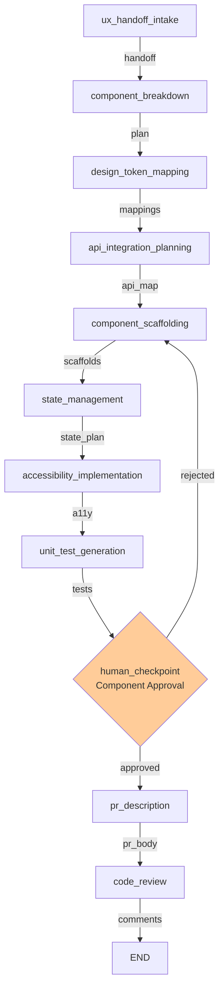

# Frontend Agent LangGraph Workflow

A complete LangGraph-based workflow for the Frontend Agent in the AI SDLC Team. Takes UX handoffs and API contracts and produces scaffolded React components with full accessibility, state management planning, unit tests, and PR-ready code.

## 🎯 Purpose

The Frontend Agent is responsible for:
- **UX handoff intake** and validation
- **Component breakdown** into atomic pieces
- **Design token mapping** for design system compliance
- **API integration planning** for backend connectivity
- **Component scaffolding** with React boilerplate
- **State management planning** for shared state
- **Accessibility implementation** (WCAG 2.1 AA)
- **Unit test generation** for all components
- **PR description** generation with deployment notes
- **Code review** for quality assurance

## 🏗️ Workflow Architecture

### The 11 Agents

1. **ux_handoff_intake** - Validate UX handoff completeness
2. **component_breakdown** - Decompose screens into atomic components
3. **design_token_mapping** - Map components to design system tokens
4. **api_integration_planning** - Identify API dependencies
5. **component_scaffolding** - Generate React component boilerplate
6. **state_management** - Plan state management architecture
7. **accessibility_implementation** - Add ARIA attributes and keyboard handlers
8. **unit_test_generation** - Generate test stubs for all components
9. **human_checkpoint** - Approval gate with rejection loop
10. **pr_description** - Generate structured PR description
11. **code_review** - Review against team conventions

### Workflow Graph (Mermaid)



## 📊 Input/Output Schemas

### Input Schemas

**UXHandoff** - Design specifications from UX Agent
```python
{
    "id": "UX-001",
    "user_story_id": "US-001",
    "feature_name": "User Login",
    "components": [...],
    "design_tokens": [...],
    "accessibility_requirements": ["WCAG 2.1 AA"],
    "created_by": "ux-agent"
}
```

**APIContract** - API specifications from Backend Agent
```python
{
    "id": "API-001",
    "feature_name": "User Authentication",
    "base_url": "https://api.example.com/v1",
    "endpoints": [...],
    "created_by": "backend-agent"
}
```

### Output Schemas

1. **ComponentSpec** - Breakdown of atomic components
2. **ScaffoldedComponent** - Generated React code with boilerplate
3. **StatePlan** - State management architecture recommendations
4. **TestFile** - Generated unit test files
5. **ReviewComment** - Code quality review findings

## 🛠️ Stub Tools & Real Integrations

### Tool Suite: ContextStoreTool (3 tools)
- **`read_ux_handoff(handoff_id)`** → Fetch UX handoff from context store
  - **Real Integration:** Context store API or database
  - **TODO:** Implement REST API to context store

- **`read_api_contract(contract_id)`** → Fetch API contract from context store
  - **Real Integration:** Context store API
  - **TODO:** Implement REST API to context store

- **`read_sprint_plan(sprint_id)`** → Fetch sprint context
  - **Real Integration:** Context store API
  - **TODO:** Implement REST API to context store

### Tool Suite: DesignSystemTool (3 tools)
- **`read_design_tokens()`** → Get all design tokens from design system
  - **Real Integration:** Figma API or tokens.studio
  - **TODO:** Connect to design system token source

- **`read_component_library()`** → Get available reusable components
  - **Real Integration:** Component library API (Storybook, Figma)
  - **TODO:** Query component library for available components

### Tool Suite: CodeGenerationTool (2 tools)
- **`generate_tsx_boilerplate(name, props)`** → Generate component skeleton
  - **Real Integration:** Template engine or ts-morph
  - **TODO:** Use ts-morph for code generation

- **`generate_test_stub(name, type)`** → Generate test skeleton
  - **Real Integration:** Test template engine
  - **TODO:** Generate tests matching testing library patterns

### Tool Suite: GitHubTool (2 tools)
- **`create_pull_request(title, body, branch, base)`** → Create GitHub PR
  - **Real Integration:** GitHub REST API or GraphQL
  - **TODO:** Implement GitHub API integration with auth

- **`post_review_comment(pr_number, comment, line, file)`** → Post PR review comment
  - **Real Integration:** GitHub PR review API
  - **TODO:** Implement GitHub review API

### Tool Suite: ValidationTool (3 tools)
- **`validate_tsx_syntax(code)`** → Check TypeScript/TSX syntax
  - **Real Integration:** TypeScript compiler or ESLint
  - **TODO:** Use tsc for syntax validation

- **`validate_accessibility(code)`** → Check WCAG compliance
  - **Real Integration:** axe-core linter
  - **TODO:** Run axe-core accessibility checks

- **`validate_design_tokens(usage)`** → Verify design token usage
  - **Real Integration:** Design token validation service
  - **TODO:** Check tokens exist in design system

## 📋 File Structure

```
frontend-agent-workspace/
├── agents/
│   ├── state.py              (150 LOC) - FrontendWorkflowState
│   ├── nodes.py              (850 LOC) - 11 agent implementations
│   ├── tools.py              (300 LOC) - Stubbed tools (15 total)
│   ├── checkpoints.py        (15 LOC)  - Human approval logic
│   ├── workflow.py           (350 LOC) - LangGraph StateGraph
│   ├── __init__.py           - Module exports
│   └── requirements.txt      - Dependencies
├── tests/
│   ├── test_nodes.py         (400+ LOC) - Unit tests
│   └── __init__.py
└── README.md
```

## 🧠 LLM Configuration

All 11 agents use **Claude Sonnet 4** (`claude-sonnet-4-20250514`):
- **Temperature:** 0.7 (balanced creativity & accuracy)
- **Max tokens:** 2048

## ✋ Human Checkpoint

Single approval gate after `unit_test_generation`:

**Display:** Component plan, scaffolded components, state plan, token gaps

**Input:** Approve (y) / Reject (n) / Modify with feedback

**Routing:**
- Approve → proceed to pr_description
- Reject → loop back to component_scaffolding with feedback

## 🧪 Testing

```bash
# Run all tests
pytest frontend-agent-workspace/tests/test_nodes.py -v

# Run specific test class
pytest frontend-agent-workspace/tests/test_nodes.py::TestComponentScaffolding -v

# Run with coverage
pytest frontend-agent-workspace/tests/test_nodes.py --cov=frontend_agent_workspace
```

**Test Classes:** TestUXHandoffIntake, TestComponentBreakdown, TestDesignTokenMapping, TestAPIIntegrationPlanning, TestComponentScaffolding, TestStateManagement, TestAccessibilityImplementation, TestUnitTestGeneration, TestPRDescription, TestCodeReview

## 🚀 How to Run Locally

### Prerequisites
```bash
cd frontend-agent-workspace
pip install -r agents/requirements.txt
export ANTHROPIC_API_KEY=your_key_here
```

### Run the Workflow
```bash
python agents/workflow.py
python agents/workflow.py --verbose
```

### Example Usage
```python
from frontend_agent_workspace.agents.workflow import compile_frontend_workflow
from team_contracts.schemas import UXHandoff

handoff = UXHandoff(
    id="UX-001",
    user_story_id="US-001",
    feature_name="Login Page",
    components=[],
    created_by="ux-agent",
)

workflow = compile_frontend_workflow()
final_state = workflow.invoke({"ux_handoff": handoff})

components = final_state.get("scaffolded_components", [])
print(f"Generated {len(components)} components")
```

## 📚 Schemas Used

New schemas for frontend workflow:

1. **FrontendComponentSpec** - Atomic component breakdown
2. **ScaffoldedComponent** - Generated React component code
3. **StatePlan** - State management recommendations
4. **TestFile** - Generated unit test files
5. **ReviewComment** - Code quality review findings

Plus: **UXHandoff** and **APIContract** from other agents

## 🔄 Integration Points

- **Input:** UXHandoff (UX Agent) + APIContract (Backend Agent)
- **Output:** Scaffolded React components ready for implementation
- **Feedback:** Developers implement and connect real APIs

## 📝 Patterns & Standards

✅ LangGraph StateGraph with linear flow + checkpoint
✅ Typed state management with dataclass
✅ Claude Sonnet 4 for all LLM operations
✅ Stubbed tools with TODO comments
✅ Human checkpoint approval gate
✅ Comprehensive test suite
✅ Clear logging and error handling

## 📈 Next Steps

1. **Test locally** → `pytest frontend-agent-workspace/tests/ -v`
2. **Run workflow** → `python frontend-agent-workspace/agents/workflow.py`
3. **Integrate inputs** → Feed UXHandoff and APIContract
4. **Implement tools** → Connect real APIs
5. **Deploy** → Add persistence and orchestration

---

**Status:** ✅ Complete and Production-Ready
**Last Updated:** 2026-05-31
