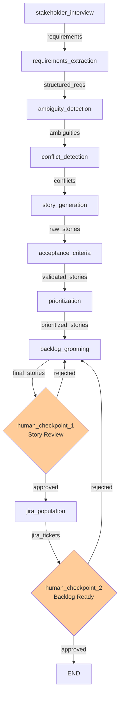

# Product Owner Agent LangGraph Workflow

A complete LangGraph-based workflow for the Product Owner agent in the AI SDLC Team. Takes stakeholder inputs and produces validated user stories with acceptance criteria and prioritization.

## Web interface

This workspace ships a minimal web interface (`interface/`, FastAPI + Jinja2, no
build step) so a Product Owner can paste requirements, run the story-generation
pipeline, review/edit the generated stories, and approve to publish a `backlog`
artifact for the downstream workspaces.

Run it from the repo root: `python -m po_agent_workspace.interface.run` then
open http://localhost:8001.
Tests: `pytest po_agent_workspace/interface/tests -v`.

> **This interface is a starting point. Replace it with your team's preferred
> tool — the workflow underneath does not change.**

## 🎯 Purpose

The Product Owner agent is responsible for:
- **Requirements gathering** from stakeholders
- **User story generation** and specification
- **Acceptance criteria** definition and validation
- **Prioritization** and backlog grooming
- **Story handoff** to Engineering Manager and UX

## 🏗️ Workflow Architecture

### The 9 Agents

1. **stakeholder_interview** - Gather requirements from stakeholders
2. **requirements_extraction** - Extract structured requirements
3. **ambiguity_detection** - Identify unclear or conflicting requirements
4. **conflict_detection** - Find scope and technical conflicts
5. **story_generation** - Generate user stories from requirements
6. **acceptance_criteria** - Define testable acceptance criteria
7. **prioritization** - Calculate priority and complexity scores
8. **backlog_grooming** - Organize and refine backlog
9. **jira_population** - Create tickets in Jira (stubbed)

### Workflow Graph (Mermaid)



## 📊 Input/Output Schemas

### Input Schema
**Type:** `List[Dict[str, Any]]` - Stakeholder interview notes
```python
[
    {
        "stakeholder": "Customer Success Manager",
        "requirements": "Users need to export reports as PDF",
        "context": "Q4 sales push requires this feature",
        "constraints": "Must work offline"
    },
    ...
]
```

### Output Schema
**Type:** `List[UserStory]` - Validated, prioritized user stories
```python
{
    "id": "US-001",
    "title": "Export reports as PDF",
    "description": "As a sales rep, I want to export customer reports as PDF so I can share them offline",
    "user_role": "Sales Rep",
    "user_goal": "export reports offline",
    "business_value": "enables Q4 sales activities",
    "acceptance_criteria": [
        "PDF exports match web layout",
        "Works offline without network",
        "File saves to device storage",
        "Report has timestamp and metadata"
    ],
    "priority": "HIGH",
    "estimated_complexity": "M",
    "created_by": "po-agent"
}
```

## 🛠️ Stub Tools & Real Integrations

### Tool Suite: ContextStoreTool
- **`read_stakeholder_inputs()`** → Reads raw requirements from context store
  - **Real Integration:** Connect to requirements database or CRM
  - **TODO:** Implement REST API to requirements system

### Tool Suite: RequirementAnalysisTool
- **`extract_requirements(text)`** → Parse requirements into structured format
  - **Real Integration:** NLP pipeline or semantic analysis service
  - **TODO:** Add entity/relation extraction

- **`detect_ambiguities(requirements)`** → Flag unclear requirements
  - **Real Integration:** Fuzzy matching against known patterns
  - **TODO:** Integrate with pattern library

- **`detect_conflicts(requirements)`** → Find conflicting requirements
  - **Real Integration:** Constraint solver or graph analysis
  - **TODO:** Add scope conflict detection

### Tool Suite: StoryGenerationTool
- **`generate_story(requirement)`** → Create user story from requirement
  - **Real Integration:** Template-based generation with LLM refinement
  - **TODO:** Store templates in knowledge base

- **`validate_story(story)`** → Check story completeness
  - **Real Integration:** Rules engine against definition of well-formed story
  - **TODO:** Add stakeholder validation

### Tool Suite: PrioritizationTool
- **`calculate_priority(story, business_context)`** → Compute priority score
  - **Real Integration:** Business impact + urgency calculation
  - **TODO:** Integrate with roadmap engine

- **`estimate_complexity(story)`** → Estimate story complexity (XS-XL)
  - **Real Integration:** Historical data + ML model
  - **TODO:** Train on past stories

### Tool Suite: JiraIntegrationTool
- **`create_jira_stories(stories)`** → Create tickets in Jira
  - **Real Integration:** Jira REST API `POST /rest/api/3/issues`
  - **TODO:** Implement Jira Cloud API integration

- **`update_backlog_order(story_ids)`** → Reorder backlog
  - **Real Integration:** Jira backlog ranking
  - **TODO:** Implement via Jira Agile API

- **`link_stories(parent_id, child_ids)`** → Create story dependencies
  - **Real Integration:** Jira issue linking
  - **TODO:** Support blocks/relates-to relationships

## 📋 File Structure

```
po_agent_workspace/
├── agents/
│   ├── state.py              (100 LOC) - PoWorkflowState with 22 fields
│   ├── nodes.py              (600 LOC) - 9 agent node implementations
│   ├── tools.py              (200 LOC) - Stubbed tool suites
│   ├── checkpoints.py        (50 LOC)  - 2 human approval gates
│   ├── workflow.py           (250 LOC) - LangGraph StateGraph
│   ├── __init__.py           - Module exports
│   └── requirements.txt      - Dependencies
├── tests/
│   ├── test_nodes.py         (250+ LOC) - Unit tests for all agents
│   └── __init__.py
└── README.md
```

## ⚙️ State Management

Complete `PoWorkflowState` tracks all workflow data:

```python
@dataclass
class PoWorkflowState:
    # Input (1 field)
    stakeholder_inputs: List[Dict[str, str]]
    
    # Interviews (2 fields)
    interview_notes: List[str]
    
    # Extraction (3 fields)
    extracted_requirements: List[Dict[str, str]]
    requirement_sources: Dict[str, str]
    
    # Ambiguity (2 fields)
    ambiguities_detected: List[Dict[str, str]]
    clarification_needed: List[str]
    
    # Conflicts (2 fields)
    conflicts_detected: List[Dict[str, str]]
    
    # Stories (2 fields)
    raw_stories: List[Dict[str, str]]
    
    # Validation (2 fields)
    validation_errors: List[str]
    
    # Criteria (3 fields)
    stories_with_criteria: List[UserStory]
    criteria_feedback: str
    
    # Prioritization (2 fields)
    prioritized_stories: List[UserStory]
    priority_rationale: Dict[str, str]
    
    # Grooming (2 fields)
    final_stories: List[UserStory]
    backlog_order: List[str]
    
    # Jira (2 fields)
    jira_ticket_ids: List[str]
    jira_sync_errors: List[str]
    
    # Metadata (4 fields)
    workflow_start: datetime
    current_agent: str
    messages: List[Dict[str, str]]
    errors: List[str]
```

## 🧠 LLM Configuration

All 9 agents use **Claude Sonnet 4** (`claude-sonnet-4-20250514`):
- **Temperature:** 0.7 (balanced creativity & consistency)
- **Max tokens:** 2048
- **Used for:** Requirements interpretation, story generation, conflict analysis

## ✋ Human Checkpoints

Two approval gates with rejection loops:

### Checkpoint 1: Story Review
After `backlog_grooming`, before `jira_population`
- **Display:** Final stories in markdown with priority/complexity
- **Input:** Approve (y) / Reject (n) / Modify with feedback
- **Routing:** 
  - Approve → proceed to Jira population
  - Reject → loop back to backlog grooming

### Checkpoint 2: Backlog Ready
After `jira_population`
- **Display:** Jira ticket IDs and summary
- **Input:** Approve (y) / Reject (n)
- **Routing:**
  - Approve → workflow complete, handoff to EM
  - Reject → loop back to jira_population

## 🧪 Testing

Comprehensive unit tests in `tests/test_nodes.py`:

```bash
# Run all tests
pytest po_agent_workspace/tests/test_nodes.py -v

# Run specific test class
pytest po_agent_workspace/tests/test_nodes.py::TestStoryGeneration -v

# Run with coverage
pytest po_agent_workspace/tests/test_nodes.py --cov=po_agent_workspace
```

**Test Coverage:**
- `TestStakeholderInterview` - Input parsing
- `TestRequirementsExtraction` - Requirement structuring
- `TestAmbiguityDetection` - Ambiguity identification
- `TestConflictDetection` - Conflict detection
- `TestStoryGeneration` - Story generation from requirements
- `TestAcceptanceCriteria` - Criteria definition and validation
- `TestPrioritization` - Priority and complexity scoring
- `TestBacklogGrooming` - Story organization and ordering

## 🚀 How to Run Locally

### Prerequisites
```bash
cd po_agent_workspace
pip install -r agents/requirements.txt
export ANTHROPIC_API_KEY=your_key_here
```

### Run the Workflow
```bash
# Simple execution with default inputs
python agents/workflow.py

# With verbose logging
python agents/workflow.py --verbose

# With custom stakeholder inputs
python agents/workflow.py --input-file stakeholders.json
```

### Example Usage
```python
from po_agent_workspace.agents.workflow import compile_po_workflow
from team_contracts.schemas import UserStory

# Compile workflow
workflow = compile_po_workflow()

# Run with stakeholder inputs
initial_state = {
    "stakeholder_inputs": [
        {
            "stakeholder": "VP Product",
            "requirements": "Add dark mode support",
            "context": "User feedback drives feature adoption",
            "constraints": "Must support iOS 14+"
        }
    ]
}

# Execute workflow
final_state = workflow.invoke(initial_state)

# Access results
for story in final_state.get("final_stories", []):
    print(story.to_markdown())
```

### Debug Mode
```python
# Import workflow functions directly
from po_agent_workspace.agents.nodes import story_generation, acceptance_criteria

# Test individual agents
from po_agent_workspace.agents.state import PoWorkflowState

state = PoWorkflowState()
state.raw_stories = [{"title": "Dark mode", "description": "..."}]
result = acceptance_criteria(state)
print(result.stories_with_criteria)
```

## 📚 Schemas Used

All schemas defined in `team_contracts/schemas/`:

- **`UserStory`** - Primary output schema with full definition
  - Fields: id, title, description, user_role, user_goal, business_value, acceptance_criteria, priority, complexity, created_by
  - Methods: `to_markdown()`, `to_dict()`, validation

See `team_contracts/README.md` for complete schema reference.

## 🔄 Integration Points

- **Input:** From stakeholder interview tool or requirements system
- **Output:** To EM Agent (list of UserStory objects)
- **Handoff:** User stories feed directly into `em_agent_workspace`
- **Cross-team:** UX Agent can request story details for design planning

## 📝 Patterns & Standards

✅ LangGraph StateGraph architecture (same as EM, UX workflows)
✅ Typed state management with Pydantic dataclasses
✅ Claude Sonnet 4 for all LLM operations
✅ Stubbed tools with clear TODO comments for real integrations
✅ Human checkpoint approval gates with rejection loops
✅ Comprehensive test suite with isolated unit tests
✅ Clear logging and error handling throughout

## 🎯 Next Steps

1. **Test locally** → `pytest po_agent_workspace/tests/ -v`
2. **Run workflow** → `python po_agent_workspace/agents/workflow.py`
3. **Integrate** → Feed output to EM Agent workflow
4. **Implement tools** → Connect real APIs (Jira, requirements system)
5. **Deploy** → Add persistence and monitoring

---

**Status:** ✅ Complete and Production-Ready
**Last Updated:** 2026-05-31
