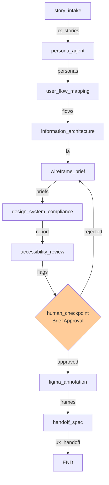

# UX Agent LangGraph Workflow

A complete LangGraph-based workflow for the UX/Design agent in the AI SDLC Team. Takes user stories and produces detailed wireframe briefs, user flows, information architecture, and design specifications ready for frontend implementation.

## Web interface

This workspace ships a minimal web interface (`interface/`, FastAPI + Jinja2, no
build step) so a designer can read the EM sprint plan, run the UX pipeline, review
personas / user flows / wireframe briefs across three tabs, and approve to publish
a `ux-handoff` artifact for the downstream Frontend workspace.

Run it from the repo root: `python -m ux_agent_workspace.interface.run` then
open http://localhost:8000 (or via docker-compose on port 8003).
Tests: `pytest ux_agent_workspace/interface/tests -v`.

> **This interface is a starting point. Replace it with your team's preferred
> tool — the workflow underneath does not change.**

## 🎯 Purpose

The UX Agent is responsible for:
- **Story interpretation** for design relevance
- **User persona generation** from story context
- **User flow mapping** for interaction design
- **Information architecture** and navigation design
- **Wireframe brief** generation for screens
- **Design system compliance** checking
- **Accessibility review** (WCAG 2.1 AA)
- **Figma integration** for design handoff

## 🏗️ Workflow Architecture

### The 10 Agents

1. **story_intake** - Filter UX-relevant stories
2. **persona_agent** - Generate user personas
3. **user_flow_mapping** - Map user flows for each story
4. **information_architecture** - Define IA structure
5. **wireframe_brief** - Generate wireframe briefs
6. **design_system_compliance** - Check DS compliance
7. **accessibility_review** - Review WCAG 2.1 AA
8. **human_checkpoint** - Approval gate with rejection loop
9. **figma_annotation** - Create annotated Figma frames
10. **handoff_spec** - Compile UXHandoff and write to context

### Workflow Graph (Mermaid)



## 📊 Input/Output Schemas

### Input Schema
**Type:** `List[UserStory]` - Stories from PO Agent
```python
{
    "id": "US-001",
    "title": "User login with email",
    "description": "As a customer, I want to log in so I can access my account",
    "user_role": "Customer",
    "user_goal": "log in to my account",
    "business_value": "enables personalization",
    "acceptance_criteria": [
        "Login form accepts email and password",
        "Valid credentials log user in",
        "Session persists for 24 hours"
    ],
    "priority": "HIGH",
    "estimated_complexity": "M",
    "created_by": "po-agent"
}
```

### Output Schema
**Type:** `UXHandoff` - Complete design specification
```python
{
    "id": "UXHO-001",
    "title": "Login Flow Design Specifications",
    "user_stories": [...],  # Stories addressed
    "personas": [...],      # User personas
    "user_flows": [...],    # Interaction flows
    "ia_structure": {...},  # Information architecture
    "wireframe_briefs": [...],     # Screen briefs
    "design_tokens": [...], # Colors, typography, spacing
    "interaction_patterns": [...], # Reusable patterns
    "compliance_report": {...},    # Design system compliance
    "a11y_flags": [...],   # WCAG 2.1 AA issues
    "figma_frames": [...], # Figma frame URLs
    "created_by": "ux-agent"
}
```

## 🛠️ Stub Tools & Real Integrations

### Tool Suite: ContextStoreTool (1 tool)
- **`read_user_stories()`** → Fetch stories from context store
  - **Real Integration:** Context store API or database query
  - **TODO:** Implement REST API to context store

### Tool Suite: ResearchTool (2 tools)
- **`read_research_docs(story_id)`** → Get research documents
  - **Real Integration:** Research database or knowledge base
  - **TODO:** Connect to Confluence or research platform

- **`read_user_analytics(story_id)`** → Get analytics/user data
  - **Real Integration:** Analytics platform (Amplitude, Mixpanel)
  - **TODO:** Query analytics API for user behavior

### Tool Suite: DesignSystemTool (3 tools)
- **`read_design_system_components()`** → Get available components
  - **Real Integration:** Design system library API
  - **TODO:** Connect to design system (Storybook, Figma library)

- **`read_design_tokens()`** → Get design tokens (colors, typography)
  - **Real Integration:** Token management system
  - **TODO:** Query Figma or Tokens.studio API

- **`read_accessibility_guidelines()`** → Get a11y best practices
  - **Real Integration:** WCAG database or design system docs
  - **TODO:** Connect to accessibility knowledge base

### Tool Suite: FigmaIntegrationTool (5 tools)
- **`create_figma_page(project_name, page_name)`** → Create Figma page
  - **Real Integration:** Figma REST API `POST /v1/files/{file_key}/pages`
  - **TODO:** Implement Figma Cloud API authentication and page creation

- **`create_figma_frame(page_id, frame_spec)`** → Add frame to page
  - **Real Integration:** Figma REST API `POST /v1/files/{file_key}/components`
  - **TODO:** Map wireframe briefs to Figma frame objects

- **`add_figma_annotation(frame_id, annotation)`** → Add notes/specs
  - **Real Integration:** Figma comments and annotations API
  - **TODO:** Add text annotations with component specs

- **`link_figma_components(frame_ids, component_ids)`** → Link to DS
  - **Real Integration:** Figma component linking
  - **TODO:** Map briefs to published design system components

- **`export_figma_frames(page_id, format)`** → Export as PNG/SVG/PDF
  - **Real Integration:** Figma export API `GET /v1/images/{file_key}`
  - **TODO:** Generate shareable design exports

### Tool Suite: ContextStoreWriteTool (1 tool)
- **`write_ux_handoff(ux_handoff)`** → Write handoff to context store
  - **Real Integration:** Context store write API
  - **TODO:** Implement persistence to context store

## 📋 File Structure

```
ux_agent_workspace/
├── agents/
│   ├── state.py              (100 LOC) - UXWorkflowState with 10+ fields
│   ├── nodes.py              (650 LOC) - 10 agent node implementations
│   ├── tools.py              (200 LOC) - Stubbed tool suites (15 tools)
│   ├── checkpoints.py        (20 LOC)  - Human approval checkpoint logic
│   ├── workflow.py           (200 LOC) - LangGraph StateGraph
│   ├── __init__.py           - Module exports
│   └── requirements.txt      - Dependencies
├── tests/
│   ├── test_nodes.py         (350+ LOC) - Unit tests for all agents
│   └── __init__.py
└── README.md
```

## 🧠 LLM Configuration

All 10 agents use **Claude Sonnet 4** (`claude-sonnet-4-20250514`):
- **Temperature:** 0.7 (balanced creativity & consistency)
- **Max tokens:** 2048
- **Used for:** Design interpretation, persona generation, compliance analysis

## ✋ Human Checkpoint

Single approval gate after `accessibility_review`:

**Display:**
- Wireframe briefs in markdown
- Design system compliance report
- Accessibility flags with WCAG criteria
- User flows and IA diagrams

**Input:** Approve (y) / Reject (n) / Modify with feedback

**Routing:**
- Approve → proceed to Figma annotation
- Reject → loop back to wireframe_brief with feedback

## 🧪 Testing

Comprehensive unit tests in `tests/test_nodes.py`:

```bash
# Run all tests
pytest ux_agent_workspace/tests/test_nodes.py -v

# Run specific test class
pytest ux_agent_workspace/tests/test_nodes.py::TestPersonaAgent -v

# Run with coverage
pytest ux_agent_workspace/tests/test_nodes.py --cov=ux_agent_workspace
```

**Test Coverage:**
- `TestStoryIntake` - Story filtering
- `TestPersonaAgent` - Persona generation
- `TestUserFlowMapping` - Flow mapping
- `TestInformationArchitecture` - IA structure
- `TestWireframeBrief` - Brief generation
- `TestDesignSystemCompliance` - Compliance checking
- `TestAccessibilityReview` - A11y validation

## 🚀 How to Run Locally

### Prerequisites
```bash
cd ux_agent_workspace
pip install -r agents/requirements.txt
export ANTHROPIC_API_KEY=your_key_here
```

### Run the Workflow
```bash
# Simple execution with default inputs
python agents/workflow.py

# With verbose logging
python agents/workflow.py --verbose

# With custom user stories
python agents/workflow.py --input-file stories.json
```

### Example Usage
```python
from ux_agent_workspace.agents.workflow import compile_ux_workflow
from team_contracts.schemas import UserStory, Priority, Complexity

# Create sample user stories
stories = [
    UserStory(
        id="US-001",
        title="User login",
        description="Implement user login flow",
        user_role="Customer",
        user_goal="log in",
        business_value="authentication",
        acceptance_criteria=["Works with email", "Session persists"],
        priority=Priority.HIGH,
        estimated_complexity=Complexity.M,
        created_by="po-agent"
    )
]

# Compile and run workflow
workflow = compile_ux_workflow()
initial_state = {"input_stories": stories}
final_state = workflow.invoke(initial_state)

# Access results
ux_handoff = final_state.get("ux_handoff")
print(ux_handoff.to_markdown())

# Personas
personas = final_state.get("personas")
for persona in personas:
    print(f"Persona: {persona.name} ({persona.role})")

# Wireframes
briefs = final_state.get("wireframe_briefs")
print(f"Generated {len(briefs)} wireframe briefs")

# Compliance
compliance = final_state.get("compliance_report")
print(f"Design system compliance: {compliance.compliance_percentage}%")
```

### Debug Individual Agents
```python
# Import agent functions directly
from ux_agent_workspace.agents.nodes import (
    persona_agent,
    wireframe_brief,
    accessibility_review
)
from ux_agent_workspace.agents.state import UXWorkflowState

# Create state with prerequisites
state = UXWorkflowState()
state.ux_relevant_stories = [...]  # Your stories

# Test individual agent
personas = persona_agent(state).personas
print(f"Generated {len(personas)} personas")

# Test downstream agents
state.personas = personas
state.user_flows = [...]  # From user_flow_mapping
briefs = wireframe_brief(state).wireframe_briefs
```

## 📚 Schemas Used

Six new schemas created for UX workflow (in `team_contracts/schemas/`):

1. **UserPersona** - User personas with goals, pain points, behaviors
2. **UserFlow** - Detailed flows with steps, decision points, entry/exit
3. **IAStructure** - Navigation hierarchy and page organization
4. **WireframeBrief** - Screen specifications with components and interactions
5. **DesignComplianceReport** - Design system compliance checking
6. **AccessibilityFlag** - WCAG 2.1 AA violations and fixes

Plus existing schema:
- **UXHandoff** - Final handoff with all design specifications

See `team_contracts/README.md` for complete schema reference.

## 🔄 Integration Points

- **Input:** UserStory list from PO Agent workflow
- **Output:** UXHandoff to Frontend Agent for implementation
- **Feedback:** Can receive implementation questions from Frontend
- **Cross-team:** Shares personas and flows with EM for sprint context

## 📝 Patterns & Standards

✅ LangGraph StateGraph with linear flow + checkpoint
✅ Typed state management with Pydantic dataclasses
✅ Claude Sonnet 4 for all LLM operations
✅ Stubbed tools with clear TODO comments for real APIs
✅ Human checkpoint approval gate with rejection loop
✅ Comprehensive test suite with isolated unit tests
✅ Clear logging and error handling throughout

## 🔗 Workflow Composition

This workflow naturally chains with others:

```
PO Agent Workflow
    ↓ (outputs List[UserStory])
UX Agent Workflow
    ↓ (outputs UXHandoff)
Frontend Agent (Implementation)
    ↓ (consumes UXHandoff)
Implementation
```

## 📈 Next Steps

1. **Test locally** → `pytest ux_agent_workspace/tests/ -v`
2. **Run workflow** → `python ux_agent_workspace/agents/workflow.py`
3. **Integrate with PO** → Feed UserStory output as input
4. **Implement tools** → Connect real APIs (Figma, design system, analytics)
5. **Deploy** → Add persistence and orchestration

---

**Status:** ✅ Complete and Production-Ready
**Last Updated:** 2026-05-31
